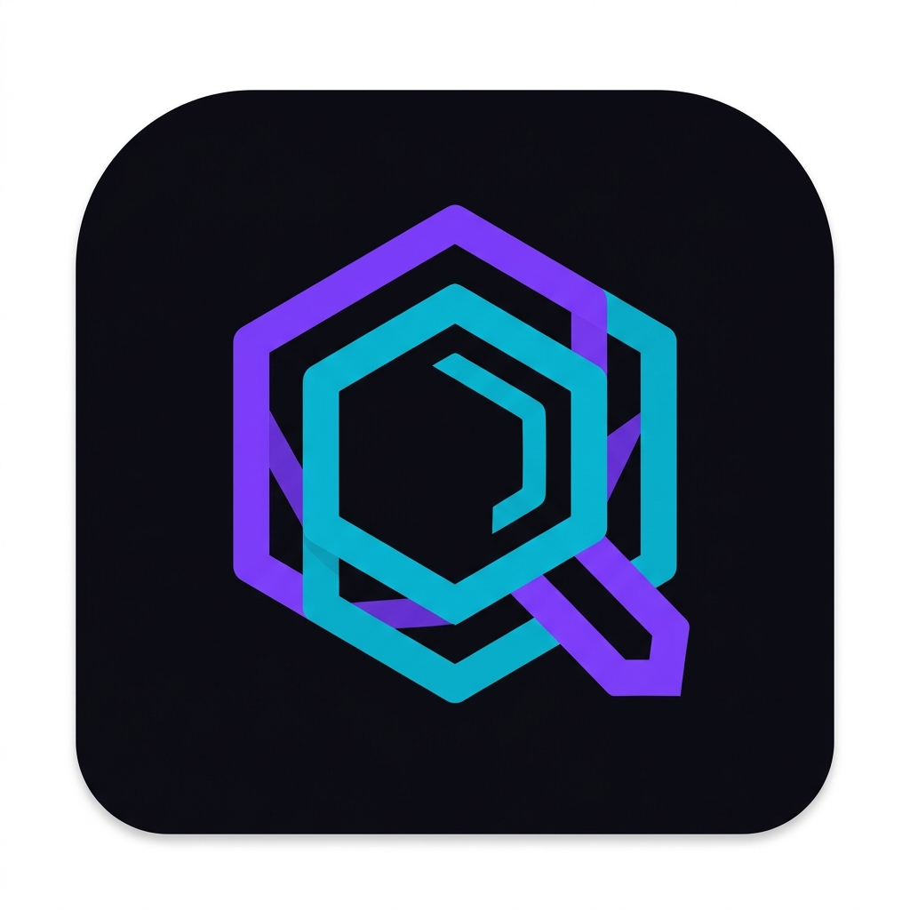

<p align="center">
  
</p>

<h1 align="center">DevLens</h1>

<p align="center">
  <strong>Browser desktop para desenvolvimento web com IA</strong><br/>
  Clique em qualquer elemento da sua página e descubra exatamente qual arquivo de código o gerou.
</p>

<p align="center">
  
  
  
  
  
</p>

---

## 🎯 O Problema que Resolve

Quando você pede para uma IA modificar parte visual de um projeto web, precisa informar **qual arquivo** contém aquele componente. Encontrar isso manualmente — especialmente em projetos grandes com dezenas de componentes — é trabalhoso.

**DevLens resolve isso em um clique.** Aponte para qualquer elemento na tela, veja o arquivo-fonte na barra inferior, clique para copiar o caminho e cole direto no chat da IA.

---

## ✨ Funcionalidades

| Funcionalidade | Descrição |
|---|---|
| 🌐 **Browser embutido** | Navegue para qualquer URL (ex: `http://localhost:3000`) |
| 🔍 **Modo Inspeção** | Ative com o botão ou `Ctrl+I` |
| 🎯 **Highlight visual** | Borda roxa aparece ao passar o mouse sobre qualquer elemento |
| 📁 **Exibição do arquivo** | Mostra `src/components/Botao.jsx` na barra inferior |
| 📋 **Copiar com um clique** | Clique no elemento → caminho copiado para a área de transferência |
| ⚛️ **React, Vue, HTML** | Detecta automaticamente o framework do projeto |

---

## 🖥️ Como Usar o App

### 1. Abra seu projeto local
Inicie o servidor de desenvolvimento do seu projeto normalmente:
```bash
# React/Vite
npm run dev

# Next.js
npm run dev

# Vue
npm run dev
```

### 2. Abra o DevLens
Execute o instalador ou o portátil da pasta `dist/` (veja [Como Gerar o Executável](#-como-gerar-o-executável)).

### 3. Navegue para o localhost
Digite a URL na barra de endereços e pressione `Enter`:
```
http://localhost:3000
```

### 4. Ative o Modo Inspeção
Clique no botão **"Inspecionar"** na barra superior, ou use o atalho:

> `Ctrl + I`

### 5. Identifique o componente
- Passe o mouse sobre qualquer elemento → aparece uma borda roxa + tooltip com o arquivo
- A barra inferior mostra: **framework**, **nome do componente** e **caminho do arquivo**

### 6. Copie o caminho
Clique no elemento destacado **ou** no botão **"Copiar Caminho"** na barra inferior.  
O caminho fica na área de transferência — basta colar no chat da IA!

```
✅ Copiado: src/components/BotaoPrincipal.jsx
```

---

## 🔬 Como a Detecção Funciona

O DevLens usa uma estratégia de **fallback progressivo** para identificar o arquivo-fonte:

### Camada 1 — React Fiber ⚛️ *(mais precisa)*
Lê a propriedade interna `__reactFiber._debugSource` do nó DOM, que contém **arquivo + número da linha**. Disponível automaticamente em projetos React rodando em **modo de desenvolvimento**.

> Para garantir que funciona, confirme que seu `vite.config.js` está em modo `dev` (padrão) ou que o plugin `@babel/plugin-transform-react-jsx-source` está ativo.

### Camada 2 — Vue 3 Component 💚
Lê `__vueParentComponent.type.__file` exposto pelo Vue 3 em dev mode. Retorna o **caminho do arquivo `.vue`**.

### Camada 3 — Atributo `data-source` 📌
Suporta projetos que injetam manualmente o atributo `data-source="filepath:linha"` via plugin de build (ex: Babel, Vite plugin personalizado).

### Camada 4 — Tag HTML 🌐 *(fallback)*
Se nenhuma informação de framework for encontrada, exibe apenas o nome da tag HTML (`<button>`, `<div>`, etc.).

---

## 🛠️ Como Gerar o Executável

### Pré-requisitos
- [Node.js](https://nodejs.org/) versão 18 ou superior
- Windows x64

### Passo a Passo

**1. Clone o repositório**
```bash
git clone https://github.com/sandrotech/rastreador-de-componentes-.git
cd rastreador-de-componentes-
```

**2. Instale as dependências**
```bash
npm install
```

**3. Gere o executável**
```bash
npm run build
```

Isso vai criar dois arquivos na pasta `dist/`:

| Arquivo | Descrição |
|---|---|
| `DevLens Setup 1.0.0.exe` | **Instalador** com atalho na Área de Trabalho |
| `DevLens-Portable-1.0.0.exe` | **Portátil** — roda sem instalar, funciona em pendrive |

> ⏱️ O primeiro build pode levar alguns minutos (baixa o runtime do Electron ~108 MB). Os builds seguintes são muito mais rápidos pois o cache é reutilizado.

### Rodar em Modo Desenvolvimento (sem build)
```bash
npm start
```

---

## 📁 Estrutura do Projeto

```
devlens/
├── main.js                 # Processo principal Electron (janela, IPC)
├── preload.js              # Bridge da janela principal (clipboard, APIs)
├── webview-preload.js      # Bridge da webview (expõe __devlens_bridge__)
├── package.json            # Dependências + config do electron-builder
├── convert-icon.ps1        # Script PowerShell para converter PNG → ICO
│
├── src/
│   ├── injected/
│   │   └── inspector.js    # ⭐ Script injetado na página: detecta React/Vue/HTML
│   └── ui/
│       ├── index.html      # Layout da janela (titlebar, toolbar, webview, infobar)
│       ├── style.css       # Tema dark premium
│       └── renderer.js     # Lógica da UI: navegação, toggle inspector, IPC
│
├── assets/
│   ├── icon.png            # Ícone do app (PNG)
│   └── icon.ico            # Ícone do app (ICO — gerado pelo convert-icon.ps1)
│
└── dist/                   # Gerado pelo `npm run build` (não versionado)
    ├── DevLens Setup 1.0.0.exe
    └── DevLens-Portable-1.0.0.exe
```

---

## ⚙️ Arquitetura Técnica

```
┌─────────────────────────────────────────────────────────────┐
│                    Janela Principal (Electron)               │
│                                                             │
│  [Toolbar: URL + Inspect Button]                            │
│                                                             │
│  ┌─────────────────────────────────────────────────────┐   │
│  │              WEBVIEW (Chromium embutido)             │   │
│  │                                                     │   │
│  │   Página do projeto (localhost:3000)                │   │
│  │                                                     │   │
│  │   ← inspector.js injetado dinamicamente aqui →     │   │
│  └─────────────────────────────────────────────────────┘   │
│                                                             │
│  [Info Bar: framework | componente | arquivo:linha | copy]  │
└─────────────────────────────────────────────────────────────┘

Fluxo de dados:
  [Usuário hover] → inspector.js lê React Fiber / Vue / data-attr
                 → __devlens_bridge__.sendInfo()
                 → ipcRenderer.sendToHost()
                 → webview 'ipc-message'
                 → renderer.js atualiza Info Bar
```

---

## 🔑 Atalhos de Teclado

| Atalho | Ação |
|---|---|
| `Ctrl + I` | Ativar / Desativar Modo Inspeção |
| `Ctrl + L` | Focar a barra de URL |
| `Enter` | Navegar para a URL digitada |

---

## 🧩 Compatibilidade de Frameworks

| Framework | Versão | Precisão | Requisito |
|---|---|---|---|
| **React** | 16+ | ⭐⭐⭐ Arquivo + Linha | Modo `dev` com Vite/CRA |
| **Vue 3** | 3.x | ⭐⭐ Arquivo | Modo `dev` com Vite |
| **Next.js** | 13+ | ⭐⭐ Arquivo + Linha | `NODE_ENV=development` |
| **HTML puro** | — | ⭐ Tag HTML | — |

> **Projetos em modo de produção (build)**: a detecção de arquivo-fonte não funciona pois os metadados de debug são removidos. O DevLens é uma ferramenta de **desenvolvimento**.

---

## ❓ Perguntas Frequentes

**O Windows bloqueou o `.exe` dizendo que é desconhecido, o que fazer?**  
Clique em **"Mais informações"** → **"Executar assim mesmo"**. Isso acontece porque o app não possui assinatura de código digital (certificado pago). O app é seguro.

**O hover não está mostrando o arquivo, por que?**  
O projeto alvo precisa estar rodando em **modo de desenvolvimento** (`npm run dev`), não em build de produção. Verifique também se é React ou Vue — HTML puro não tem metadados de arquivo.

**Funciona com projetos rodando em outro computador da rede?**  
Sim! Qualquer URL é válida: `http://192.168.1.100:3000`, `http://meusite.local`, etc.

**Posso usar com Angular ou Svelte?**  
Ainda não com detecção automática. Esses frameworks não expõem metadados de debug no DOM por padrão. Suporte planejado para versões futuras.

---

## 🗺️ Roadmap

- [ ] Suporte a Angular e Svelte
- [ ] Abrir o arquivo diretamente no VS Code com um clique
- [ ] Painel lateral com histórico de componentes inspecionados
- [ ] Suporte a source maps para builds de produção
- [ ] Configuração de "raiz do projeto" para exibir caminhos relativos corretos

---

## 📄 Licença

MIT © DevLens
